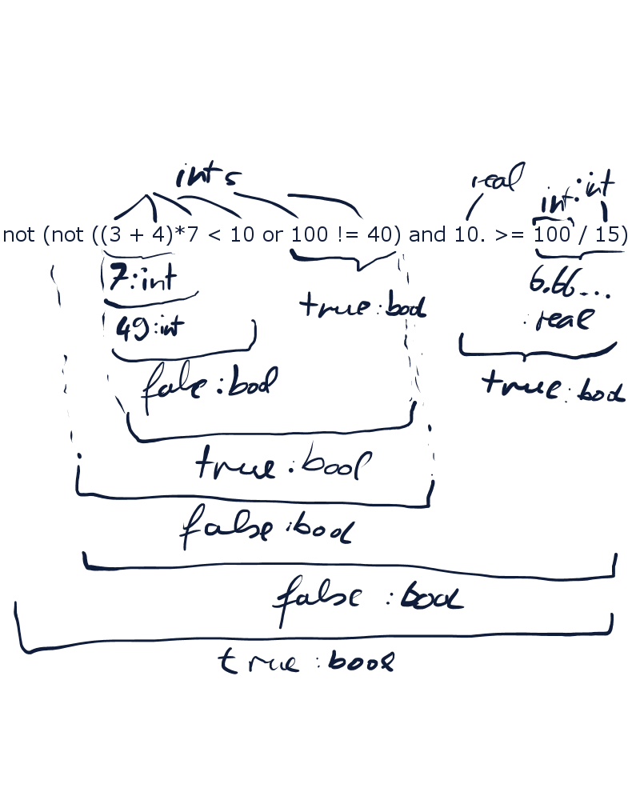

# Übung 1

## Übung 1.1

Das lässt sich zum Beispiel raus finden mit folgenden Ausdrücken:

	> false and true or true == false and (true or true)
	res = false     // boolean
	> false and true or true == (false and true) or true
	res = true     // boolean
	
Hier sieht man, dass die Klammern zuerst um das `and` kommen. And bindet also stärker!

## Übung 1.2

# Übung 2

## Übung 2.1

	function maximum3a(real x, real y, real z) returns real
		if x > y
			if x > z
				return x
			else // z > x > y
				return z
		else // y >= x
			if y > z
				return y
			else
				return z

## Übung 2.2
				
	function maximum3b(real x, real y, real z) returns real
		return maximum(x, maximum(y,z))
		

## Übung 2.3

	function bla(boolean x, boolean y) returns boolean
		return not x and y
	
	function blub(boolean x, boolean y) returns boolean
		return not (x or y)

	function naund(boolean x, boolean y) returns boolean
		return false
		
## Übung 2.4

### Lösung 1

	constant int rock = 0
	constant int scissors = 1	
	constant int paper = 2
		
	function rockPaperScissors(int player1choice, int player2choice)
		if player1choice == player2choice
			print("Unentschieden")	
		else if player1choice == rock and player2choice == scissors 
			// Stein gewinnt gegen Schere
			print("Spieler 1 gewinnt") 
		else if player1choice == scissors and player2choice == paper
			// Schere gewinnt gegen Papier
			print("Spieler 1 gewinnt") 
		else if player1choice == paper and player2choice == rock
			// Papier gewinnt gegen Stein
			print("Spieler 1 gewinnt") 
		else 
			// wenn Spieler 1 nicht gewonnen hat 
			// und es nicht unentschieden ist, muss Spieler 2 gewonnen haben
			print("Spieler 2 gewinnt")
			
### Lösung 2 (Zusatzaufgabe)

	constant int rock = 0
	constant int scissors = 1	
	constant int paper = 2
		
	function rockPaperScissors(int player1choice, int player2choice)
		if player1choice == player2choice
			print("Unentschieden")	
		else 
			print("Spieler " + I2S((player2choice - player1choice) mod 3) + " gewinnt")	
			
